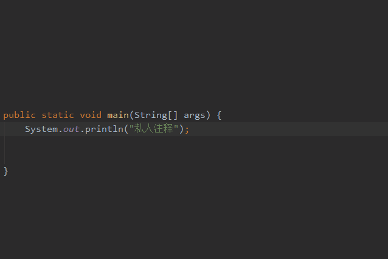
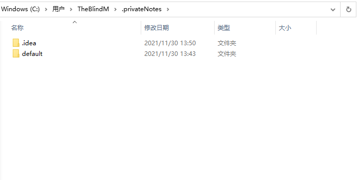

# private-notes 私人注释
点一下star ✨,是对作者最大的支持
#### 介绍

 你还在为项目中不敢添加 "敏感注释"! 

 源码是只读文件不能添加注释而烦恼吗？ 

 在任何你想加注释的地方 按下**Alt + Enter**鼠标移出点击即可保存 

 已有私人注释 按下**Alt + Enter**即可快速编辑 
 
 **Alt + p** 可快速添加或者编辑私人注释
 
 **Alt + o** 展示私人注释的其它操作
 
 右键菜单 选择 **私人注释** 查看操作
 
      

#### 安装
打开IntelliJ IDEA -> plugin，搜索 Private Notes，安装重启即可

#### 配置

#### 同步
私人注释 都缓存在 当前用户目录下的 .privateNotes文件夹中,如需同步，可以借助强大的Git

如果你熟练git命令可以直接通过 命令的方式，或者通过idea像我们平时一样

将项目导入idea中,并上传到gitee或者github中
[将项目首次导入到 gitee中](https://blog.csdn.net/qq_40495860/article/details/102722894)

当你完成第一次上传时,即可使用右键 **私人注释** 中的Git操作 完成快速的 Pull和CommitAndPush操作
 
**注意**：必须 使用Git命令或者Idea 完成第一次提交

